```mermaid
sequenceDiagram
    autonumber

    actor Admin
    actor ISP
    actor Teknisi
    participant FE as Frontend (React)
    participant BE as Backend (NestJS)
    participant DB as Database (PostgreSQL)
    participant FS as File Storage
    participant VH as Valhalla (Routing Engine)

    %% ─────────────────────────────────────────
    %% BLOK 1: AUTENTIKASI
    %% ─────────────────────────────────────────
    rect rgb(230, 240, 255)
        Note over Admin, VH: BLOK 1 — AUTENTIKASI (semua role)

        Admin->>FE: Buka aplikasi → halaman Login
        FE->>BE: POST /api/auth/login {username, password}
        BE->>DB: Query user by username
        DB-->>BE: Data user + role
        BE->>BE: Verifikasi password hash
        BE-->>FE: Response: token + role (admin/isp/teknisi)
        FE->>FE: Simpan session, set menu & rute sesuai role
        FE-->>Admin: Redirect ke Dashboard (defaultSection: customers)

        ISP->>FE: Buka aplikasi → halaman Login
        FE->>BE: POST /api/auth/login {username, password}
        BE-->>FE: Response: token + role (isp)
        FE-->>ISP: Redirect ke Dashboard (defaultSection: customers/tenant)

        Teknisi->>FE: Buka aplikasi → halaman Login
        FE->>BE: POST /api/auth/login {username, password}
        BE-->>FE: Response: token + role (teknisi)
        FE-->>Teknisi: Redirect ke Dashboard (defaultSection: monitoring)
    end

    %% ─────────────────────────────────────────
    %% BLOK 2: MANAJEMEN ISP (Admin only)
    %% ─────────────────────────────────────────
    rect rgb(255, 240, 220)
        Note over Admin, VH: BLOK 2 — MANAJEMEN ISP (Admin only)

        Admin->>FE: Buka menu Pelanggan → tab ISP
        FE->>BE: GET /api/isps
        BE->>DB: Query semua ISP
        DB-->>BE: List ISP
        BE-->>FE: Response: list ISP
        FE-->>Admin: Tampilkan daftar ISP

        Admin->>FE: Klik "Tambah ISP" → isi form
        FE->>BE: POST /api/isps {nama, paket, jumlah, periode, ...}
        BE->>DB: Insert ISP baru
        DB-->>BE: ISP tersimpan
        BE-->>FE: Response: data ISP baru
        FE-->>Admin: Toast sukses, ISP muncul di daftar

        Admin->>FE: Buka Detail ISP → Upload kontrak ISP
        FE->>FS: Upload file kontrak
        FS-->>FE: URL file
        FE->>BE: POST /api/isps/:id/contract-file {fileUrl}
        BE->>DB: Update IspContractRow dengan contractFileUrl
        DB-->>BE: OK
        BE-->>FE: Response sukses
        FE-->>Admin: Kontrak ISP tersimpan

        Admin->>FE: Proses Renewal ISP → Upload surat penawaran
        FE->>FS: Upload file penawaran
        FS-->>FE: URL file
        FE->>BE: POST /api/isps/:id/renewal {renewalFileUrl}
        BE->>DB: Update IspContractRow renewalStatus = pending
        BE->>DB: Insert IspRenewalFollowUp (source: upload)
        DB-->>BE: OK
        BE-->>FE: Response sukses
        FE-->>Admin: Status renewal: pending

        Admin->>FE: Input respons ISP (lanjut/tidak) + upload BAK
        FE->>FS: Upload file BAK
        FS-->>FE: URL file BAK
        FE->>BE: POST /api/isps/:id/renewal/respond {decision, bakFileUrl}
        BE->>DB: Update IspContractRow renewalStatus = renewed / terminated
        BE->>DB: Update IspRenewalFollowUp status = completed
        DB-->>BE: OK
        BE-->>FE: Response sukses
        FE-->>Admin: Renewal selesai, status diperbarui
    end

    %% ─────────────────────────────────────────
    %% BLOK 3: MANAJEMEN PELANGGAN (Admin)
    %% ─────────────────────────────────────────
    rect rgb(220, 255, 230)
        Note over Admin, VH: BLOK 3 — MANAJEMEN PELANGGAN (Admin)

        Admin->>FE: Buka menu Pelanggan → tab Tenant
        FE->>BE: GET /api/customers
        BE->>DB: Query semua pelanggan
        DB-->>BE: List pelanggan
        BE-->>FE: Response: list pelanggan
        FE-->>Admin: Tampilkan daftar pelanggan

        Admin->>FE: Klik "Tambah Pelanggan" → isi form
        FE->>BE: POST /api/customers {nama, ispId, kode, ...}
        BE->>DB: Insert Customer baru
        BE->>DB: Insert CustomerIspMembership
        DB-->>BE: OK
        BE-->>FE: Response: data pelanggan baru
        FE-->>Admin: Toast sukses, pelanggan muncul di daftar

        Admin->>FE: Buka Detail Pelanggan → tab Kontrak → Tambah Kontrak
        FE->>BE: POST /api/customers/:id/contracts {nomorKontrak, startDate, endDate, coreType, ...}
        BE->>DB: Insert Contract baru (status: aktif)
        BE->>DB: Update Customer status = aktif
        DB-->>BE: OK
        BE-->>FE: Response sukses
        FE-->>Admin: Kontrak tersimpan, pelanggan aktif

        Admin->>FE: Tab Kontrak → Perpanjang Kontrak
        FE->>BE: POST /api/customers/:id/contracts/:cid/versions {startDate, endDate, ...}
        BE->>DB: Insert ContractVersion baru (versionNumber++)
        BE->>DB: Insert ContractVersionRenewalFollowUp
        DB-->>BE: OK
        BE-->>FE: Response sukses
        FE-->>Admin: Versi kontrak baru tersimpan
    end

    %% ─────────────────────────────────────────
    %% BLOK 4: ARSIP DOKUMEN (Admin)
    %% ─────────────────────────────────────────
    rect rgb(255, 230, 255)
        Note over Admin, VH: BLOK 4 — ARSIP DOKUMEN & OTOMASI (Admin)

        Admin->>FE: Detail Pelanggan → tab Dokumen → Upload Dokumen
        FE->>FE: Buka modal upload (customer auto-filled)
        Admin->>FE: Pilih jenis dokumen, isi nomor, tanggal, pilih file
        FE->>FS: Upload file dokumen
        FS-->>FE: URL file
        FE->>BE: POST /api/customers/:id/documents {jenisDokumen, nomorDokumen, tanggalDokumen, fileUrl}
        BE->>DB: Insert Document

        alt jenisDokumen = kontrak
            BE->>DB: Insert/Update Contract (status: aktif)
            BE->>DB: Update Customer status = aktif
        else jenisDokumen = invoice
            BE->>DB: Insert/Update Invoice (status: belum_ditagih)
            Note right of BE: Sel monitoring bulan terkait diperbarui
        else jenisDokumen = perpanjangan
            BE->>DB: Insert ContractVersion baru
            BE->>DB: Extend Contract endDate
        else jenisDokumen = pemutusan
            BE->>DB: Update Customer status = nonaktif
            BE->>DB: Update Contract status = terminated
        else jenisDokumen = BAK
            BE->>DB: Link Document ke ContractVersion.bakDocumentId
        end

        DB-->>BE: OK
        BE-->>FE: Response: dokumen + entitas yang terpengaruh
        FE-->>Admin: Toast sukses + ringkasan perubahan

        Admin->>FE: Lihat daftar dokumen pelanggan (filter per jenis)
        FE->>BE: GET /api/customers/:id/documents
        BE->>DB: Query documents by customerId ORDER BY tanggalDokumen DESC
        DB-->>BE: List dokumen
        BE-->>FE: Response: list dokumen
        FE-->>Admin: Tabel dokumen dengan label warna per jenis
    end

    %% ─────────────────────────────────────────
    %% BLOK 5: MONITORING BILLING
    %% ─────────────────────────────────────────
    rect rgb(255, 255, 210)
        Note over Admin, VH: BLOK 5 — MONITORING BILLING (Admin, ISP, Teknisi)

        Admin->>FE: Buka menu Monitoring
        FE->>BE: GET /api/monitoring/billing?year=2026&isp=&status=
        BE->>DB: Query invoices JOIN customers JOIN contracts (filter tahun, ISP)
        DB-->>BE: Data billing per pelanggan per bulan
        BE-->>FE: Response: matrix billing [pelanggan x bulan]
        FE-->>Admin: Tampilkan spreadsheet monitoring

        ISP->>FE: Buka menu Monitoring
        FE->>BE: GET /api/monitoring/billing?year=2026&isp={ispId}
        BE->>DB: Query invoices filtered by ISP
        DB-->>BE: Data billing ISP terkait
        BE-->>FE: Response: matrix billing (hanya tenant ISP ini)
        FE-->>ISP: Tampilkan spreadsheet monitoring (read-only)

        Teknisi->>FE: Buka menu Monitoring
        FE->>BE: GET /api/monitoring/billing?year=2026
        BE-->>FE: Response: matrix billing semua pelanggan
        FE-->>Teknisi: Tampilkan spreadsheet monitoring (read-only)

        Admin->>FE: GET /api/monitoring/alerts?year=2026
        FE->>BE: GET /api/monitoring/alerts?year=2026
        BE->>DB: Query kontrak mendekati expired, invoice belum ditagih
        DB-->>BE: List alerts
        BE-->>FE: Response: list alerts
        FE-->>Admin: Tampilkan notifikasi/badge alert di dashboard
    end

    %% ─────────────────────────────────────────
    %% BLOK 6: INVOICE FOLLOW-UP (Admin)
    %% ─────────────────────────────────────────
    rect rgb(230, 255, 255)
        Note over Admin, VH: BLOK 6 — FOLLOW-UP INVOICE (Admin)

        Admin->>FE: Detail Pelanggan → tab Invoice → lihat invoice belum bayar
        FE->>BE: GET /api/customers/:id/invoices
        BE->>DB: Query invoices by customerId
        DB-->>BE: List invoice + follow-up
        BE-->>FE: Response: list invoice
        FE-->>Admin: Tampilkan invoice dengan status & follow-up

        Admin->>FE: Klik follow-up invoice → update status
        FE->>BE: PATCH /api/customers/:id/invoices/:invId/follow-up {status: sent}
        BE->>DB: Update InvoiceFollowUp status
        DB-->>BE: OK
        BE-->>FE: Response sukses
        FE-->>Admin: Status follow-up diperbarui (warning → sent → completed)

        Admin->>FE: Upload bukti pembayaran invoice
        FE->>FS: Upload file bukti bayar
        FS-->>FE: URL file
        FE->>BE: PATCH /api/customers/:id/invoices/:invId {status: lunas, paymentProofFileUrl}
        BE->>DB: Update Invoice status = lunas, paidAt = now()
        DB-->>BE: OK
        BE-->>FE: Response sukses
        FE-->>Admin: Invoice lunas, monitoring diperbarui
    end

    %% ─────────────────────────────────────────
    %% BLOK 7: ROUTE PLANNER FO (Admin & Teknisi)
    %% ─────────────────────────────────────────
    rect rgb(240, 230, 255)
        Note over Admin, VH: BLOK 7 — ROUTE PLANNER FO (Admin & Teknisi)

        Teknisi->>FE: Detail Pelanggan → tab Jalur → buka Route Planner
        FE->>BE: GET /api/customers/:id/routes/current
        BE->>DB: Query CustomerRouteVersion terbaru + CustomerRoutePoints
        DB-->>BE: Data jalur aktif
        BE-->>FE: Response: versi jalur + titik-titik
        FE-->>Teknisi: Tampilkan peta dengan jalur existing

        Teknisi->>FE: Tambah/ubah titik jalur di peta
        FE->>VH: POST /route {waypoints} (Valhalla routing)
        VH-->>FE: Response: geometri jalur optimal
        FE-->>Teknisi: Tampilkan preview jalur di peta

        Teknisi->>FE: Simpan jalur baru
        FE->>BE: POST /api/customers/:id/routes {points, changeMode: ubah_jalur, note}
        BE->>DB: Insert CustomerRouteVersion baru (versionNumber++)
        BE->>DB: Insert CustomerRoutePoints
        BE->>DB: Insert CustomerRouteHistory (snapshotBefore, snapshotAfter)
        DB-->>BE: OK
        BE-->>FE: Response: versi jalur baru
        FE-->>Teknisi: Toast sukses, jalur tersimpan

        Teknisi->>FE: Update status jalur (aktif/nonaktif/gangguan)
        FE->>BE: PATCH /api/customers/:id/routes/:versionId/status {flowStatus}
        BE->>DB: Update CustomerRouteVersion flowStatus
        BE->>DB: Insert CustomerRouteHistory (operation: status)
        DB-->>BE: OK
        BE-->>FE: Response sukses
        FE-->>Teknisi: Status jalur diperbarui

        Teknisi->>FE: Lihat riwayat perubahan jalur
        FE->>BE: GET /api/customers/:id/routes/history
        BE->>DB: Query CustomerRouteHistory ORDER BY createdAt DESC
        DB-->>BE: List riwayat
        BE-->>FE: Response: list riwayat dengan snapshot
        FE-->>Teknisi: Tampilkan timeline perubahan jalur
    end

    %% ─────────────────────────────────────────
    %% BLOK 8: COMPLIANCE STATUS & TIMELINE
    %% ─────────────────────────────────────────
    rect rgb(245, 245, 245)
        Note over Admin, VH: BLOK 8 — COMPLIANCE STATUS & TIMELINE (semua role)

        Admin->>FE: Detail Pelanggan → tab Overview
        FE->>BE: GET /api/customers/:id/compliance-status
        BE->>DB: Query dokumen wajib, kontrak aktif, invoice terbaru
        DB-->>BE: Status kepatuhan (ada/tidak kontrak, invoice, dll)
        BE-->>FE: Response: compliance badges
        FE-->>Admin: Tampilkan badge: kontrak aktif ✓, invoice bulan ini ✓, dll

        Admin->>FE: Detail Pelanggan → tab Timeline
        FE->>BE: GET /api/customers/:id/timeline
        BE->>DB: Query documents + invoices + contracts + route history ORDER BY date DESC
        DB-->>BE: List aktivitas
        BE-->>FE: Response: timeline aktivitas
        FE-->>Admin: Tampilkan timeline kronologis aktivitas pelanggan
    end

    %% ─────────────────────────────────────────
    %% BLOK 9: TEMPAT SAMPAH (Admin only)
    %% ─────────────────────────────────────────
    rect rgb(255, 235, 235)
        Note over Admin, VH: BLOK 9 — TEMPAT SAMPAH (Admin only)

        Admin->>FE: Hapus pelanggan dari daftar
        FE->>BE: DELETE /api/customers/:id
        BE->>DB: Soft delete Customer (status = arsip / deleted_at)
        DB-->>BE: OK
        BE-->>FE: Response sukses
        FE-->>Admin: Pelanggan hilang dari daftar aktif

        Admin->>FE: Buka menu Tempat Sampah
        FE->>BE: GET /api/trash/customers
        BE->>DB: Query customers WHERE deleted = true
        DB-->>BE: List pelanggan terhapus
        BE-->>FE: Response: list sampah
        FE-->>Admin: Tampilkan daftar pelanggan di tempat sampah

        Admin->>FE: Pulihkan pelanggan
        FE->>BE: POST /api/trash/customers/:id/restore
        BE->>DB: Update Customer deleted = false
        DB-->>BE: OK
        BE-->>FE: Response sukses
        FE-->>Admin: Pelanggan kembali ke daftar aktif
    end
```

# Sequence Diagram Komprehensif — Sistem Arsip KIMA

Diagram ini menggambarkan alur interaksi seluruh role (Admin, ISP, Teknisi) dengan sistem secara komprehensif.

> Render menggunakan: VS Code extension "Mermaid Preview", GitHub, atau https://mermaid.live

---

---

## Ringkasan Blok Diagram

| Blok | Alur | Role |
|---|---|---|
| 1 | Autentikasi & session role | Admin, ISP, Teknisi |
| 2 | Manajemen ISP & renewal kontrak ISP | Admin |
| 3 | Manajemen pelanggan & kontrak | Admin |
| 4 | Upload dokumen & otomasi bisnis | Admin |
| 5 | Monitoring billing spreadsheet | Admin, ISP, Teknisi |
| 6 | Follow-up & pembayaran invoice | Admin |
| 7 | Route planner FO dengan Valhalla | Admin, Teknisi |
| 8 | Compliance status & timeline aktivitas | Admin, ISP, Teknisi |
| 9 | Tempat sampah (soft delete & restore) | Admin |
